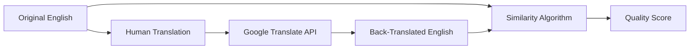

# Translation & Audio Validation System

## Overview

The Levante validation system includes two complementary approaches:

1. **Translation Validation**: Uses **back-translation** with **similarity scoring** to assess translation quality
2. **Audio Validation**: Uses **ASR transcription** with **advanced similarity metrics** to assess audio generation quality

Both systems help identify potential issues before production deployment.

## Recent Validation Updates (Jan 2026)

- **HTML normalization before scoring**: Source and translated strings are converted to plain text (HTML tags stripped) before similarity/AI evaluation.
- **Alias-safe language keys**: Validation read/write resolves `en`<->`en-US` and `de`<->`de-DE` so locale migrations do not orphan prior results.
- **Back-translation resilience in modal**:
  - If legacy records are missing `backTranslation`, the modal can generate it on demand.
  - Generated back-translation is written back into the active validation record for reuse.
- **Compact snapshot retention**: Compact local snapshots now retain `backTranslation` (trimmed) along with score metadata.
- **Rendering coordination**: `Validate All` ensures full language table render before scanning rows, avoiding partial-job creation.

## How It Works

### 1. Back-Translation Process



**Step 1:** Original English text is translated by humans into target language  
**Step 2:** The human translation is sent to Google Translate API  
**Step 3:** Google Translate converts it back to English  
**Step 4:** The original English is compared with the back-translated English  
**Step 5:** A similarity score determines translation quality  

### 2. Similarity Calculation Algorithm

The runtime scorer uses a **deterministic composite baseline + AI adjudication**:

1. **Semantic score (0-100)** via embedding cosine similarity on original vs back-translation
2. **Lexical score (0-100)** via normalized Levenshtein distance
3. **Composite score (0-100)** with content-aware weights:
   - Vocab-like rows: `0.35 * semantic + 0.65 * lexical`
   - Sentence/survey-like rows: `0.80 * semantic + 0.20 * lexical`
4. **AI adjudication**: Gemini evaluates each non-English row and returns an AI score.
5. **Final score selection**:
   - If AI judge succeeds: final score = AI score
   - If AI judge is unavailable: final score = deterministic composite baseline

### Current Runtime Mode (Jan 2026)

- **AI mode**: `all` (not hybrid-gated in production).
- **Back-translation generation**: always computed for non-English rows so reviewers can inspect source/translation/back-translation together.
- **Semantic scorer model**: runtime endpoint uses Gemini embeddings with fallback order:
  - `GEMINI_EMBEDDING_MODEL` (if configured)
  - `gemini-embedding-001`
  - `embedding-001`
  - `text-embedding-004`
- **Semantic fallback behavior**: if semantic API fails, semantic score falls back to legacy overlap (`word-overlap-fallback`).

Implementation fields persisted per validation record:
- `semanticScore`
- `lexicalScore`
- `compositeScore`
- `semanticModel`
- `lexicalMethod`
- `scoringVersion`

## Quality Score Thresholds

| Score Range | Status | Indicator | Meaning |
|-------------|--------|-----------|---------|
| **≥ 90%** | ✅ **Excellent** | 🟢 Green | Translation preserves meaning accurately |
| **80-89%** | ⚠️ **Warning** | 🟡 Yellow | Borderline quality; review recommended |
| **< 80%** | ❌ **Poor** | 🔴 Red | Significant meaning loss, revision needed |
| **English** | 🔵 **Source** | 🔵 Blue | Original text, no validation needed |

## Interpreting Results

### ✅ **Excellent (90%+)**
- **High semantic preservation**
- Translation accurately conveys original meaning
- Safe for audio generation
- **Example:** "Hello world" → "Hola mundo" → "Hello world" (100%)

### ⚠️ **Warning (80-89%)**  
- **Moderate semantic drift**
- Core meaning preserved but nuanced differences
- Review for context-sensitive content
- **Example:** "big house" → "casa grande" → "large house" (75%)

### ❌ **Poor (<80%)**
- **Significant meaning loss**
- Translation may be incorrect or missing context
- **Requires human review**
- **Example:** "bank account" → "cuenta bancaria" → "story account" (25%)

## Language-Specific Handling

### Multi-Regional Languages
The system automatically maps regional codes to base languages for Google Translate:

- `es-CO` (Colombian Spanish) → `es` (Spanish)
- `fr-CA` (Canadian French) → `fr` (French)  
- `de-DE` (German) → `de` (German)

This ensures compatibility with Google Translate's supported language codes.

### Skip Conditions
- **English variants** (`en`, `en-US`, `en-GB`) are automatically marked as source text
- No back-translation performed on source language

## Technical Implementation

### API Endpoint
```
POST /proxy/translate
```

Additional runtime validation endpoints:
- `POST /api/translation-semantic-score` - deterministic semantic score (embedding cosine, 0-100)
- `POST /api/translation-ai-judge` - Gemini adjudicator (used on each non-English row in current runtime mode)

### Gemini Prompt Assumptions (Current)

- Runtime AI adjudication uses prompt variants by `itemType` (`vocab`, `instruction_ui`, `proper_noun`, `survey_sentence`).
- Current prompts assume child-facing content for **elementary school** audiences.
- For task prompts/instructions and child survey items, prompts assume delivery in **both text and generated audio**.
- Scoring guidance explicitly prioritizes child comprehension, spoken clarity/naturalness, actionability, and tone preservation.

### Request Format
```json
{
  "original_english": "the boy is running",
  "source_text": "el niño está corriendo", 
  "source_lang": "es",
  "target_lang": "en"
}
```

### Response Format  
```json
{
  "original_english": "the boy is running",
  "source_text": "el niño está corriendo",
  "back_translated": "the child is running", 
  "similarity_score": 78,
  "status": "good"
}
```

## Validation UI Features

### Status Indicators
- **Color-coded dots** next to each translation
- **Percentage badges** showing exact similarity scores
- **Hover tooltips** with detailed status information

### Interactive Results Panel
Click any validation button to see:
- **Side-by-side comparison** of original vs. back-translated text
- **Detailed similarity breakdown**
- **Specific differences highlighted**
- **Recommendation for next steps**

### Batch Processing
- **"Validate All"** button processes entire language sets
- **Progress tracking** with real-time status updates
- **Summary statistics** by language and quality level

## Use Cases

### 1. **Pre-Audio Quality Check**
Validate translations before generating expensive TTS audio files

### 2. **Translation Quality Assurance**  
Identify potential issues in human translations systematically

### 3. **Localization Review**
Compare translation quality across different target languages

### 4. **Content Consistency**
Ensure semantic consistency across large translation datasets

## Limitations

### Algorithm Limitations
- **Word-order independent** (doesn't account for syntax changes)
- **Vocabulary-focused** (may miss grammatical errors)
- **Length-sensitive** (longer texts may score lower despite accuracy)

### Google Translate Limitations  
- **Accuracy varies by language pair**
- **Context limitations** in automatic translation
- **Idiomatic expressions** may not translate reliably

### Recommended Usage
- Use as a **first-pass quality filter**, not definitive judgment
- **Combine with human review** for critical content
- **Consider cultural context** that automated systems miss

## API Requirements

### Google Cloud Translation API
- **API Key required** with Translation API enabled
- **Billing account** necessary (free tier available)
- **Rate limits** apply (default: 100 requests/100 seconds)

### Key Restrictions (Recommended)
- Restrict to **Cloud Translation API** only
- Add **domain restrictions** to your deployment URL
- **Monitor usage** to avoid unexpected charges

## Getting Started

1. **Enable Google Cloud Translation API** in your Google Cloud Console
2. **Generate an API key** with appropriate restrictions  
3. **Add the key** to the dashboard's Credential Manager
4. **Test validation** on a few sample translations
5. **Review results** and adjust workflow as needed

## Experimental: Multilingual Embedding Validation (No Back-Translation)

For local experimentation, you can validate translation pairs directly using multilingual embeddings.
This avoids back-translation and compares source/target semantic alignment with cosine similarity.

### Script

`scripts/embedding_translation_validation.py`

### Recommended Models

- `sentence-transformers/LaBSE` (default; strongest current bake-off performance)
- `intfloat/multilingual-e5-large` (optional secondary comparison model)
- `intfloat/multilingual-e5-base` (supported for compatibility via `--model/--models`, not default)

E5 models remain fully supported when explicitly requested:

```bash
python scripts/embedding_multidataset_model_compare.py \
  --dataset both \
  --models intfloat/multilingual-e5-large,sentence-transformers/LaBSE
```

### Local Python Setup (NVIDIA GPU)

```bash
python -m venv .venv
source .venv/bin/activate
pip install --upgrade pip
# Install CUDA-enabled torch for your driver/CUDA version, then:
pip install sentence-transformers numpy
```

### Example Run

```bash
python scripts/embedding_translation_validation.py \
  --input ../levante_translations/translations/item-bank-translations.csv \
  --source-col en \
  --target-col de \
  --id-col item_id \
  --model sentence-transformers/LaBSE \
  --device cuda \
  --batch-size 256 \
  --min-score 0.85 \
  --warn-score 0.78 \
  --summary-json data/validation/embedding-de-summary.json
```

### Output

- CSV with per-row similarity/status (`pass` / `review` / `fail`)
- Optional JSON summary (distribution percentiles and counts)

### Multi-Dataset Model Compare (Surveys + Item Bank)

Use this script to compare multiple embedding models across surveys and item bank in one run:

`scripts/embedding_multidataset_model_compare.py`

```bash
python scripts/embedding_multidataset_model_compare.py \
  --dataset both \
  --models sentence-transformers/LaBSE \
  --device cuda \
  --batch-size 256 \
  --min-score 0.85 \
  --warn-score 0.78 \
  --output-prefix data/validation/embedding-model-compare
```

### Run From The Same Crowdin XLIFF Pipeline

To align embedding validation with the dashboard's Crowdin CSV/XLIFF merge source, first export merged CSVs from Crowdin XLIFF:

```bash
node scripts/export-crowdin-xliff-merged.js \
  --approved-only \
  --output-all data/validation/crowdin-xliff-merged.csv \
  --output-surveys data/validation/crowdin-xliff-surveys.csv \
  --output-itembank data/validation/crowdin-xliff-itembank.csv \
  --output-dashboard data/validation/crowdin-xliff-dashboard.csv
```

Then run model compare against those generated files:

```bash
python scripts/embedding_multidataset_model_compare.py \
  --dataset all \
  --surveys-input-file data/validation/crowdin-xliff-surveys.csv \
  --itembank-input-file data/validation/crowdin-xliff-itembank.csv \
  --dashboard-input-file data/validation/crowdin-xliff-dashboard.csv \
  --models sentence-transformers/LaBSE \
  --device cuda \
  --batch-size 256 \
  --min-score 0.85 \
  --warn-score 0.78 \
  --output-prefix data/validation/embedding-model-compare
```

Outputs include:
- Per-dataset files:
  - `data/validation/embedding-model-compare-surveys-summary.csv/json`
  - `data/validation/embedding-model-compare-surveys-details.csv`
  - `data/validation/embedding-model-compare-itembank-summary.csv/json`
  - `data/validation/embedding-model-compare-itembank-details.csv`
  - `data/validation/embedding-model-compare-dashboard-summary.csv/json`
  - `data/validation/embedding-model-compare-dashboard-details.csv`
- Combined rollup:
  - `data/validation/embedding-model-compare-rollup-summary.csv/json`

### Build Dashboard Advisory Artifact (Offline → Online)

After the local compare run completes, build an advisory artifact for the web dashboard:

```bash
python scripts/build_embedding_advisory_artifact.py \
  --input-prefix data/validation/embedding-model-compare-full \
  --output-json data/validation/embedding-advisory.json
```

Upload it to the dev bucket so the online dashboard can load it:

```bash
gsutil cp data/validation/embedding-advisory.json \
  gs://levante-assets-dev/validation/embedding-advisory.json
```

Notes:
- Advisory data is display-only; it does not override current back-translation scoring.
- Dashboard API endpoint: `/api/embedding-advisory` (reads `validation/embedding-advisory.json` by default).

### Compare Signals Against Human Labels

Use this script to benchmark calculated composite scores, AI adjudication, and embedding advisory data against reviewer labels:

```bash
python scripts/compare_validation_signals.py \
  --human-csv data/validation/human-labeled.csv \
  --validation-json data/validation/validation-export.json \
  --embedding-json data/validation/embedding-advisory.json \
  --output-prefix data/validation/validation-signals-compare
```

Outputs:
- `data/validation/validation-signals-compare-details.csv`
- `data/validation/validation-signals-compare-summary.json` (includes Kendall tau + language threshold suggestions)

### Notes

- For E5-family models, the script automatically uses `query:` for source and `passage:` for translation.
- Source/target text is HTML-stripped by default before embedding (can be disabled with `--no-strip-html`).
- Calibrate thresholds against your known-good and known-bad translation pairs before operational use.

---

## Audio Validation System

The **Audio Validation System** complements translation validation by verifying the quality of generated TTS audio through ASR (Automatic Speech Recognition) transcription and advanced similarity analysis.

### Key Features

🎯 **Multi-Backend Transcription**
- OpenAI Whisper (state-of-the-art, local processing)
- Google Speech Recognition (cloud-based)
- Automatic GPU acceleration when available

📊 **Advanced Similarity Metrics**
- Word-level similarity with compound word matching
- Fuzzy string matching for near-matches
- BLEU and ROUGE scores for comprehensive assessment
- Word Error Rate (WER) calculation
- Phonetic normalization for better accuracy

🔧 **Robust Text Processing**
- Case-insensitive comparisons
- Punctuation and apostrophe normalization
- German umlaut handling (ä→a, ö→o, ü→u, ß→ss)
- Compound word splitting ("medium-sized" ↔ "medium sized")

### Quality Assessment Categories

| Status | Similarity Range | Description | Action Required |
|--------|------------------|-------------|-----------------|
| **EXCELLENT** | >95% | Perfect or near-perfect match | None |
| **GOOD** | 85-95% | Minor differences, acceptable quality | Optional review |
| **ACCEPTABLE** | 70-85% | Some discrepancies, may need attention | Review recommended |
| **NEEDS_REVIEW** | <70% | Significant issues detected | Manual review required |

### Web Dashboard Integration

**Access Audio Validation:**
1. Navigate to the **Audio Validation** page (`audio-validation.html`)
2. Select a validation results file from the dropdown (files are loaded from GCS in deployed environment)
3. Click **Load** to view results with sorting and filtering options

**Interactive Features:**
- **Play Audio**: Listen to original generated audio
- **Regenerate**: Create new audio with ElevenLabs using different options:
  - Default speed (1.0x)
  - Slower speeds (.9x, .7x)
  - Boost style for emphasis
- **Save**: Store improved audio back to Google Cloud Storage
- **Bulk Operations**: Process multiple files efficiently

**Duration Comparison:**
- View original and regenerated audio durations side-by-side
- Identify timing inconsistencies
- Verify speed adjustments work as expected

### Pitwall Integration

The **Pitwall** dashboard (`index.html`) includes an **Audio Validation (ASR)** component that displays:

- **Status Pill**: Overall pass rate percentage and needs review count
- **By-Language Table**: Detailed breakdown showing:
  - Language code
  - Pass percentage
  - Needs review count
  - Average similarity score
  - Total items validated

**How It Works:**
1. When you load a validation file on the Audio Validation page, it automatically publishes a summary to `/api/audio-validation-summary?key=latest`
2. The summary is stored in GCS (`levante-dashboard-dev/pitwall/audio-validation-summary/latest.json`)
3. The Pitwall dashboard fetches and displays this summary on page load
4. The summary includes overall metrics plus per-language breakdowns

**Storage:**
- **Local Development**: Summaries are stored in-memory (fallback)
- **Deployed Environment**: Summaries are stored in GCS for persistence across deployments

### Usage Examples

**Command Line Validation:**

From the `levante-web-dashboard` repo:
```bash
# Generate validation and import into dashboard
./scripts/generate-audio-validation.sh es-CO

# With auto-upload to GCS (for deployed Pitwall)
export UPLOAD_TO_GCS=1
./scripts/generate-audio-validation.sh de
```

From the `levante_translations` repo:
```bash
# Validate English audio files
./validate_language.sh en

# Validate German with custom options
python -m validate_audio "audio_files/de/*.mp3" \
    --language de --web-dashboard --model_size base
```

**Expected Output Location:**

Validation files are generated in `levante_translations/web-dashboard/public/data/`:
```
validation-{language}-{Month-Day-Year}.json
```

They are then imported into `levante-web-dashboard/data/validation/` and optionally uploaded to GCS:
```
gs://levante-dashboard-dev/pitwall/audio-validation-results/validation-{language}-{Month-Day-Year}.json
```

### Uploading Validation Files to GCS

For the deployed Pitwall to access validation files, upload them to GCS:

```bash
# Automatic upload (during generation)
export UPLOAD_TO_GCS=1
./scripts/generate-audio-validation.sh <language-code>

# Manual upload (existing files)
node scripts/upload-audio-validation-files.js

# With custom bucket/prefix
node scripts/upload-audio-validation-files.js \
    --bucket levante-dashboard-prod \
    --prefix pitwall/audio-validation-results
```

**Environment Variables:**
- `DASHBOARD_DATA_BUCKET` – GCS bucket name (default: `levante-dashboard-dev`)
- `AUDIO_VALIDATION_FILES_PREFIX` – GCS prefix for validation files (default: `pitwall/audio-validation-results`)
- `GCP_SERVICE_ACCOUNT_JSON` or `GOOGLE_APPLICATION_CREDENTIALS_JSON` – GCP credentials (required)

### Troubleshooting

**Common Issues:**
- **SSL Errors**: Fixed with conditional TTS imports
- **Language Codes**: Automatic mapping from locale codes (es-CO → es)
- **GPU Not Detected**: Install CUDA-compatible PyTorch
- **Low Similarity Scores**: Enhanced preprocessing handles most edge cases

**Performance Tips:**
- Use `--model_size base` for faster processing
- Add `--no-quality` to skip CLAP analysis
- Process files in batches for efficiency

### Technical Implementation

The audio validation system uses a multi-pass similarity algorithm:

1. **Exact Match**: Case-insensitive word comparison
2. **Compound Words**: Match split/joined word variations
3. **Phonetic Match**: Handle pronunciation variations
4. **Fuzzy Match**: Catch spelling differences and OCR errors

This approach achieves high accuracy while being robust to common transcription variations.

### ID3 Tag Management

Audio files include ID3 tags for metadata (`text`, `voice`, `service`, `lang_code`, `created`). These tags are used by the validation system to extract expected text.

**Fixing Incorrect Tags:**

If validation results show incorrect "Expected" values (e.g., item keys instead of actual translations), use the ID3 tag fixing script in `levante_translations`:

```bash
cd ../levante_translations

# Dry run (audit only)
python utilities/fix_audio_text_tags.py --lang de --csv translations/item-bank-translations.csv

# Apply fixes to 'text' tags
python utilities/fix_audio_text_tags.py --lang de --csv translations/item-bank-translations.csv --apply

# Also fix other metadata (voice, service, lang_code, created, etc.)
python utilities/fix_audio_text_tags.py --lang de --csv translations/item-bank-translations.csv --apply --fix-metadata
```

**Comparing Local vs GCS Versions:**

After fixing tags locally, compare against dev/prod buckets:

```bash
# Compare timestamps and ID3 tags
node scripts/compare-audio-file-versions.js \
    --lang de \
    --report ../levante_translations/fix-report-de-applied.json \
    --download-tags \
    --out comparison-report.json
```

This helps identify which files need to be uploaded to GCS buckets.

---

📖 **Detailed Documentation**: [validate_audio/README.md](../validate_audio/README.md)

## Support

For technical issues or algorithm questions, refer to:
- Google Cloud Translation API documentation
- Dashboard credential management guide  
- Translation workflow best practices